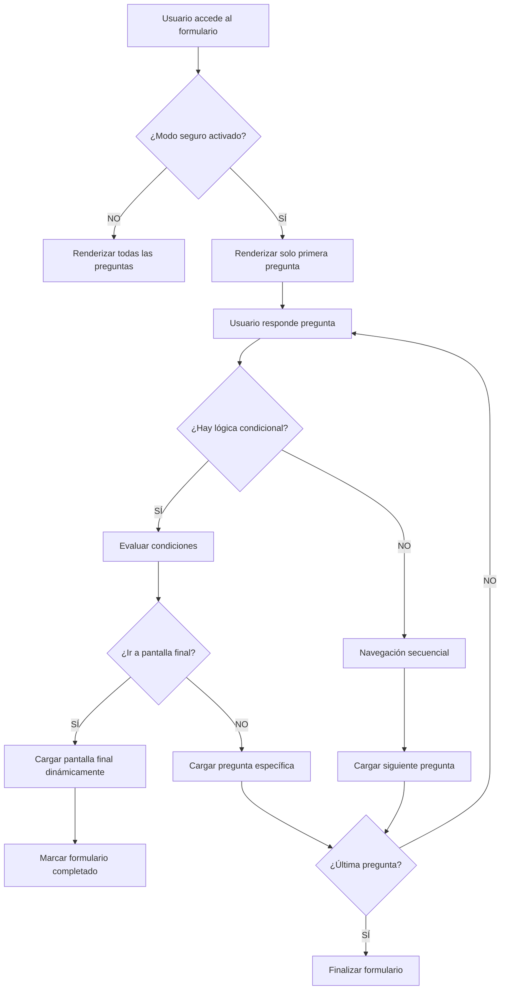

# Guía Técnica: Sistema de Carga Segura de Preguntas

## 📋 Índice
1. [Resumen Ejecutivo](#resumen-ejecutivo)
2. [Arquitectura del Sistema](#arquitectura-del-sistema)
3. [Implementación Técnica](#implementación-técnica)
4. [Configuración y Uso](#configuración-y-uso)
5. [Flujo de Funcionamiento](#flujo-de-funcionamiento)
6. [Validaciones de Seguridad](#validaciones-de-seguridad)
7. [Casos Especiales](#casos-especiales)
8. [Mantenimiento y Troubleshooting](#mantenimiento-y-troubleshooting)
9. [Consideraciones de Rendimiento](#consideraciones-de-rendimiento)

---

## 🎯 Resumen Ejecutivo

### Problema Original
El plugin de formularios renderizaba todas las preguntas en el HTML inicial, permitiendo a los usuarios inspeccionar el código fuente y ver todo el contenido del formulario sin completarlo.

### Solución Implementada
Sistema híbrido configurable que ofrece dos modos de operación:
- **Modo Seguro**: Carga dinámica de preguntas vía AJAX
- **Modo Normal**: Renderizado completo tradicional (mantiene compatibilidad)

### Beneficios Clave
- ✅ **Seguridad**: Preguntas ocultas del código fuente
- ✅ **Flexibilidad**: Configurable por formulario
- ✅ **Compatibilidad**: No rompe formularios existentes
- ✅ **Navegación Condicional**: Funciona perfectamente con lógica condicional
- ✅ **Pantallas Finales**: Soporte completo para pantallas finales dinámicas

---

## 🏗️ Arquitectura del Sistema

### Componentes Principales

```
┌─────────────────────────────────────────────────────────────┐
│                    SISTEMA HÍBRIDO                          │
├─────────────────────────────────────────────────────────────┤
│                                                             │
│  ┌─────────────────┐    ┌─────────────────────────────────┐ │
│  │   MODO NORMAL   │    │        MODO SEGURO             │ │
│  │                 │    │                                 │ │
│  │ • Renderizado   │    │ • Solo 1ª pregunta inicial     │ │
│  │   completo      │    │ • Carga dinámica vía AJAX      │ │
│  │ • HTML estático │    │ • Navegación condicional       │ │
│  │ • Máximo        │    │ • Pantallas finales dinámicas  │ │
│  │   rendimiento   │    │ • Validaciones de seguridad    │ │
│  └─────────────────┘    └─────────────────────────────────┘ │
│                                                             │
├─────────────────────────────────────────────────────────────┤
│                 CONFIGURACIÓN POR FORMULARIO                │
│              (Campo: secure_loading en settings)            │
└─────────────────────────────────────────────────────────────┘
```

### Flujo de Decisión



---

## 🔧 Implementación Técnica

### 1. Frontend (includes/class-sfq-frontend.php)

#### Método Principal: `render_form()`
```php
// Verificar modo de carga segura
$secure_loading = isset($settings['secure_loading']) && $settings['secure_loading'];

if ($secure_loading) {
    // MODO SEGURO: Solo renderizar la primera pregunta
    if (!empty($normal_questions)) {
        $first_question = $normal_questions[0];
        // Renderizar primera pregunta + contenedor dinámico
        echo '<div id="sfq-dynamic-questions-container"></div>';
    }
} else {
    // MODO NORMAL: Renderizar todas las preguntas
    foreach ($normal_questions as $index => $question) {
        // Renderizado tradicional completo
    }
}
```

#### Separación de Contenido
```php
// ✅ CRÍTICO: Separar preguntas normales de pantallas finales
$normal_questions = array();
$final_screen_questions = array();

foreach ($form->questions as $question) {
    $is_final_screen = (isset($question->pantallaFinal) && $question->pantallaFinal);
    if ($is_final_screen) {
        $final_screen_questions[] = $question;
    } else {
        $normal_questions[] = $question;
    }
}
```

#### Contenedores Dinámicos
```html
<!-- Contenedor para preguntas cargadas dinámicamente -->
<div id="sfq-dynamic-questions-container"></div>

<!-- Marcador para identificar modo seguro -->
<div class="sfq-form-container" 
     data-secure-loading="true"
     data-form-id="<?php echo $form->id; ?>">
```

### 2. Backend AJAX (includes/class-sfq-ajax.php)

#### Nuevo Endpoint: `get_secure_question()`
```php
public function get_secure_question() {
    // 1. Verificaciones de seguridad
    if (!check_ajax_referer('sfq_nonce', 'nonce', false)) {
        wp_send_json_error(__('Error de seguridad', 'smart-forms-quiz'));
        return;
    }
    
    // 2. Rate limiting
    if (!$this->check_rate_limit('get_secure_question', 20, 60)) {
        wp_send_json_error(array(
            'message' => __('Demasiadas peticiones', 'smart-forms-quiz'),
            'code' => 'RATE_LIMIT_EXCEEDED'
        ));
        return;
    }
    
    // 3. ✅ NUEVO: Aceptar question_id O question_index
    $form_id = intval($_POST['form_id'] ?? 0);
    $question_index = isset($_POST['question_index']) ? intval($_POST['question_index']) : null;
    $question_id = isset($_POST['question_id']) ? intval($_POST['question_id']) : null;
    $session_id = sanitize_text_field($_POST['session_id'] ?? '');
    
    // 4. Verificar modo seguro habilitado
    $form = $this->database->get_form($form_id);
    if (!$form || empty($form->settings['secure_loading'])) {
        wp_send_json_error(array(
            'message' => __('Modo seguro no habilitado', 'smart-forms-quiz'),
            'code' => 'SECURE_MODE_DISABLED'
        ));
        return;
    }
    
    // 5. ✅ CRÍTICO: Separar preguntas normales de pantallas finales
    $normal_questions = array();
    $final_screen_questions = array();
    $all_questions_by_id = array();
    
    foreach ($form->questions as $question) {
        $all_questions_by_id[$question->id] = $question;
        
        $is_final_screen = (isset($question->pantallaFinal) && $question->pantallaFinal);
        if ($is_final_screen) {
            $final_screen_questions[] = $question;
        } else {
            $normal_questions[] = $question;
        }
    }
    
    // 6. ✅ NUEVO: Lógica de búsqueda mejorada
    if ($question_id !== null) {
        // Búsqueda por ID (navegación condicional)
        $target_question = $all_questions_by_id[$question_id];
        $is_final_screen = (isset($target_question->pantallaFinal) && $target_question->pantallaFinal);
        
        if ($is_final_screen) {
            // Renderizar pantalla final
            $question_html = $this->render_secure_final_screen($target_question, $final_screen_questions, $settings);
        } else {
            // Renderizar pregunta normal
            $question_html = $this->render_secure_question($target_question, $target_question_index, $normal_questions, $settings);
        }
    } else {
        // Búsqueda por índice (navegación secuencial)
        if ($question_index >= count($normal_questions)) {
            // No hay más preguntas - finalizar
            wp_send_json_success(array(
                'html' => null,
                'is_last_question' => true,
                'form_completed' => true
            ));
            return;
        }
        
        $target_question = $normal_questions[$question_index];
        $question_html = $this->render_secure_question($target_question, $question_index, $normal_questions, $settings);
    }
    
    // 7. Respuesta exitosa
    wp_send_json_success(array(
        'html' => $question_html,
        'question_id' => $target_question->id,
        'question_index' => $target_question_index,
        'question_type' => $target_question->question_type,
        'is_final_screen' => $is_final_screen,
        'is_last_question' => (!$is_final_screen && $target_question_index === count($normal_questions) - 1),
        'total_questions' => count($normal_questions)
    ));
}
```

#### ✅ CRÍTICO: Renderizado de Pantallas Finales
```php
private function render_final_screen_type_secure($final_screen) {
    // ✅ SOLUCIÓN FINAL: Usar reflexión para acceder a métodos del frontend
    if ($final_screen->question_type === 'freestyle') {
        // Crear instancia temporal del frontend
        $frontend = new SFQ_Frontend();
        
        // Usar reflexión para acceder al método privado render_question_type
        $reflection = new ReflectionClass($frontend);
        $method = $reflection->getMethod('render_question_type');
        $method->setAccessible(true);
        
        // Ejecutar el método de renderizado del frontend
        $method->invoke($frontend, $final_screen);
    }
}
```

### 3. JavaScript Frontend (assets/js/frontend.js)

#### Detección de Modo Seguro
```javascript
// Detectar si estamos en modo seguro
const secureLoading = this.container.dataset.secureLoading === 'true';

if (secureLoading) {
    // Usar carga dinámica
    await this.loadQuestionSecurely(questionId);
} else {
    // Usar navegación tradicional
    this.showScreen(nextQuestion);
}
```

#### ✅ NUEVO: Soporte para Navegación Condicional
```javascript
async loadQuestionSecurely(questionId) {
    try {
        const formData = new FormData();
        formData.append('action', 'sfq_get_secure_question');
        formData.append('nonce', this.getCurrentNonce());
        formData.append('form_id', this.formId);
        formData.append('session_id', this.sessionId);
        formData.append('question_id', questionId); // ✅ Navegación por ID

        const response = await fetch(this.config.ajaxUrl, {
            method: 'POST',
            body: formData,
            headers: {
                'Cache-Control': 'no-cache, no-store, must-revalidate',
                'Pragma': 'no-cache',
                'Expires': '0'
            }
        });

        const result = await response.json();

        if (result.success && result.data && result.data.html) {
            // ✅ CRÍTICO: Manejar pantallas finales correctamente
            if (result.data.is_final_screen) {
                this.insertDynamicFinalScreen(result.data.html, questionId);
                await this.markFormAsCompleted();
            } else {
                this.insertDynamicQuestion(result.data.html, result.data.question_index, questionId);
                this.currentQuestionIndex = result.data.question_index;
                this.questionStartTime = Date.now();
                this.updateProgress();
            }
        }
    } catch (error) {
        console.error('SFQ Secure: Error loading question:', error);
        this.showError('Error de conexión al cargar la pregunta.');
    }
}
```

#### ✅ NUEVO: Inserción de Pantallas Finales Dinámicas
```javascript
insertDynamicFinalScreen(finalScreenHtml, questionId) {
    // Ocultar pregunta actual
    if (this.currentScreen) {
        this.currentScreen.classList.remove('active');
    }

    // Obtener contenedor dinámico
    const dynamicContainer = this.container.querySelector('#sfq-dynamic-questions-container');
    
    // ✅ CORREGIDO: Insertar HTML directamente
    dynamicContainer.innerHTML = finalScreenHtml;
    
    // Buscar elemento de pantalla final
    let finalScreenElement = dynamicContainer.querySelector('.sfq-final-screen');
    
    if (!finalScreenElement) {
        finalScreenElement = dynamicContainer.querySelector('.sfq-screen');
        if (finalScreenElement) {
            finalScreenElement.classList.add('sfq-final-screen');
        }
    }

    // Activar pantalla final
    finalScreenElement.classList.add('active');
    this.currentScreen = finalScreenElement;
    
    // Marcar como pantalla final
    finalScreenElement.dataset.pantallaFinal = 'true';
    finalScreenElement.dataset.questionId = questionId;

    // Reinicializar eventos
    this.bindEventsForNewQuestion(finalScreenElement);
    
    // Actualizar progreso al 100%
    this.updateProgress();
}
```

---

## ⚙️ Configuración y Uso

### Activar Modo Seguro

#### 1. Desde el Administrador de WordPress
```
1. Ir a Smart Forms Quiz > Formularios
2. Editar el formulario deseado
3. Buscar sección "Configuración Avanzada"
4. Marcar checkbox "Activar carga segura de preguntas"
5. Guardar formulario
```

#### 2. Programáticamente
```php
// Obtener configuración actual del formulario
$form = $database->get_form($form_id);
$settings = $form->settings ?: array();

// Activar modo seguro
$settings['secure_loading'] = true;

// Guardar configuración
$form_data = array(
    'id' => $form_id,
    'settings' => $settings
);
$database->save_form($form_data);
```

#### 3. Verificar Estado
```php
// Verificar si un formulario tiene modo seguro activado
$form = $database->get_form($form_id);
$is_secure = isset($form->settings['secure_loading']) && $form->settings['secure_loading'];

if ($is_secure) {
    echo "Modo seguro ACTIVADO";
} else {
    echo "Modo normal (tradicional)";
}
```

---

## 🔄 Flujo de Funcionamiento

### Modo Normal (Tradicional)
```
1. Usuario accede al formulario
2. PHP renderiza TODAS las preguntas en HTML
3. JavaScript oculta preguntas con CSS
4. Usuario navega entre preguntas (solo CSS show/hide)
5. Al finalizar, envía todas las respuestas

RESULTADO: Todas las preguntas visibles en código fuente ❌
```

### Modo Seguro (Nuevo)
```
1. Usuario accede al formulario
2. PHP renderiza SOLO la primera pregunta
3. Usuario responde primera pregunta
4. JavaScript evalúa lógica condicional
5. Si hay navegación condicional:
   - Hace petición AJAX con question_id específico
   - Puede ir a cualquier pregunta o pantalla final
6. Si es navegación secuencial:
   - Hace petición AJAX con question_index siguiente
7. Servidor valida y renderiza pregunta/pantalla solicitada
8. Se repite hasta completar formulario
9. Al finalizar, envía todas las respuestas

RESULTADO: Solo pregunta actual visible en código fuente ✅
```

### ✅ NUEVO: Diagrama de Navegación Condicional

```
Usuario          Frontend         Backend AJAX      Base de Datos
  |                |                    |                |
  |-- Responde --->|                    |                |
  |                |-- Evalúa Lógica -->|                |
  |                |                    |                |
  |                |-- AJAX Request --->|                |
  |                |   (question_id=374)|                |
  |                |                    |-- Buscar Q374->|
  |                |                    |<-- Pantalla F--|
  |                |                    |-- Renderizar ->|
  |                |<-- HTML Final -----|                |
  |<-- Pantalla F--|                    |                |
  |                |-- Mark Completed ->|                |
  |                |                    |-- UPDATE ----->|
```

---

## 🔒 Validaciones de Seguridad

### 1. Verificación de Nonce
```php
if (!check_ajax_referer('sfq_nonce', 'nonce', false)) {
    wp_send_json_error(__('Error de seguridad', 'smart-forms-quiz'));
    return;
}
```

### 2. Rate Limiting
```php
// Máximo 20 peticiones por minuto por usuario
if (!$this->check_rate_limit('get_secure_question', 20, 60)) {
    wp_send_json_error(array(
        'message' => __('Demasiadas peticiones', 'smart-forms-quiz'),
        'code' => 'RATE_LIMIT_EXCEEDED'
    ));
    return;
}
```

### 3. Validación de Datos
```php
// ✅ MEJORADO: Validar que se proporcione al menos un parámetro de búsqueda
$form_id = intval($_POST['form_id'] ?? 0);
$question_index = isset($_POST['question_index']) ? intval($_POST['question_index']) : null;
$question_id = isset($_POST['question_id']) ? intval($_POST['question_id']) : null;
$session_id = sanitize_text_field($_POST['session_id'] ?? '');

if (!$form_id || !$session_id) {
    wp_send_json_error(__('Datos incompletos', 'smart-forms-quiz'));
    return;
}

if ($question_index === null && $question_id === null) {
    wp_send_json_error(array(
        'message' => __('Debe proporcionar question_index o question_id', 'smart-forms-quiz'),
        'code' => 'MISSING_SEARCH_PARAM'
    ));
    return;
}
```

### 4. Verificación de Modo Seguro
```php
// Solo funciona si el modo seguro está habilitado
$form = $this->database->get_form($form_id);
if (!$form || empty($form->settings['secure_loading'])) {
    wp_send_json_error(array(
        'message' => __('Modo seguro no habilitado', 'smart-forms-quiz'),
        'code' => 'SECURE_MODE_DISABLED'
    ));
    return;
}
```

### 5. ✅ NUEVO: Validación de Existencia de Pregunta
```php
// Para navegación por ID
if ($question_id !== null) {
    if (!isset($all_questions_by_id[$question_id])) {
        wp_send_json_error(array(
            'message' => __('Pregunta no encontrada', 'smart-forms-quiz'),
            'code' => 'QUESTION_NOT_FOUND'
        ));
        return;
    }
}

// Para navegación por índice
if ($question_index !== null) {
    if ($question_index < 0 || $question_index >= count($normal_questions)) {
        wp_send_json_error(array(
            'message' => __('Índice de pregunta inválido', 'smart-forms-quiz'),
            'code' => 'INVALID_QUESTION_INDEX'
        ));
        return;
    }
}
```

---

## 🎯 Casos Especiales

### 1. ✅ Navegación Condicional

#### Problema Resuelto
La navegación condicional permite saltar a cualquier pregunta o pantalla final basándose en las respuestas del usuario. En modo seguro, esto requiere cargar preguntas específicas por ID.

#### Implementación
```javascript
// En el frontend, cuando se evalúa lógica condicional
if (this.skipToQuestion) {
    if (secureLoading) {
        // Cargar pregunta específica por ID
        await this.loadQuestionSecurely(this.skipToQuestion);
        this.skipToQuestion = null;
        return;
    }
}
```

#### Backend
```php
// En get_secure_question(), búsqueda por ID
if ($question_id !== null) {
    $target_question = $all_questions_by_id[$question_id];
    $is_final_screen = (isset($target_question->pantallaFinal) && $target_question->pantallaFinal);
    
    if ($is_final_screen) {
        // Renderizar pantalla final dinámicamente
        $question_html = $this->render_secure_final_screen($target_question, $final_screen_questions, $settings);
    } else {
        // Renderizar pregunta normal
        $question_html = $this->render_secure_question($target_question, $target_question_index, $normal_questions, $settings);
    }
}
```

### 2. ✅ Pantallas Finales Dinámicas

#### Problema Original
Las pantallas finales son preguntas de tipo "freestyle" que se marcan con `pantallaFinal: true`. Al cargarlas dinámicamente, el contenido aparecía vacío porque el renderizado no accedía correctamente a los elementos freestyle.

#### Solución Implementada
```php
private function render_final_screen_type_secure($final_screen) {
    // ✅ SOLUCIÓN CRÍTICA: Usar reflexión para acceder a métodos del frontend
    if ($final_screen->question_type === 'freestyle') {
        // Crear instancia temporal del frontend
        $frontend = new SFQ_Frontend();
        
        // Usar reflexión para acceder al método privado render_question_type
        $reflection = new ReflectionClass($frontend);
        $method = $reflection->getMethod('render_question_type');
        $method->setAccessible(true);
        
        // Ejecutar el método de renderizado del frontend (que ya maneja freestyle correctamente)
        $method->invoke($frontend, $final_screen);
    }
}
```

#### Por qué funciona
1. **Reutiliza lógica probada**: El método `render_question_type` del frontend ya funciona perfectamente
2. **Acceso completo a datos**: El frontend sabe cómo acceder a `freestyle_elements` desde `options`
3. **Compatibilidad total**: Mantiene toda la funcionalidad de elementos freestyle

### 3. ✅ Separación de Preguntas Normales y Pantallas Finales

#### Implementación Crítica
```php
// ✅ CRÍTICO: Separar preguntas normales de pantallas finales
$normal_questions = array();
$final_screen_questions = array();
$all_questions_by_id = array();

foreach ($form->questions as $question) {
    $all_questions_by_id[$question->id] = $question;
    
    $is_final_screen = (isset($question->pantallaFinal) && $question->pantallaFinal);
    if ($is_final_screen) {
        $final_screen_questions[] = $question;
    } else {
        $normal_questions[] = $question;
    }
}
```

#### Importancia
- **Navegación secuencial**: Solo cuenta preguntas normales para índices
- **Navegación condicional**: Puede acceder a cualquier pregunta por ID
- **Finalización**: Detecta correctamente cuándo no hay más preguntas normales

### 4. ✅ Marcado Automático como Completado

#### Implementación
```javascript
// Cuando se llega a una pantalla final
if (result.data.is_final_screen) {
    this.insertDynamicFinalScreen(result.data.html, questionId);
    
    // ✅ CRÍTICO: Marcar como completado automáticamente
    await this.markFormAsCompleted();
}
```

#### Función de Marcado Silencioso
```javascript
async markFormAsCompleted() {
    // Desactivar sistema de guardado parcial
    this.disablePartialSave();
    
    // Limpiar respuestas parciales
    await this.cleanupPartialResponsesExplicitly();
    
    // Marcar como completado en el servidor
    const formData = new FormData();
    formData.append('action', 'sfq_submit_response');
    formData.append('nonce', sfq_ajax.nonce);
    formData.append('form_id', this.formId);
    formData.append('session_id', this.sessionId);
    formData.append('responses', JSON.stringify(this.responses));
    formData.append('variables', JSON.stringify(this.variables));
    formData.append('time_spent', Math.floor((Date.now() - this.startTime) / 1000));
    formData.append('silent_completion', 'true'); // ✅ Indicar completado silencioso
    
    const response = await fetch(sfq_ajax.ajax_url, {
        method: 'POST',
        body: formData
    });
}
```

---

## 🛠️ Mantenimiento y Troubleshooting

### Logs de Debug

#### Activar Logging
```php
// En wp-config.php
define('WP_DEBUG', true);
define('WP_DEBUG_LOG', true);

// Los logs aparecerán en /wp-content/debug.log
```

#### ✅ NUEVOS: Logs Específicos del Sistema
```php
// Logs de navegación condicional
error_log('SFQ: Conditional navigation in secure mode to question: ' . $questionId);

// Logs de pantallas finales
error_log('SFQ Secure: Loading final screen dynamically: ' . $questionId);
error_log('SFQ Secure: Final screen HTML received: ' . $finalScreenHtml);

// Logs de renderizado
error_log('SFQ Secure: Dynamic final screen inserted and activated');
error_log('SFQ: Final screen loaded and form marked as completed');
```

### Problemas Comunes y Soluciones

#### 1. "Pantalla final aparece vacía"
**Causa**: Error en el renderizado de elementos freestyle
**Solución**: 
```php
// Verificar que se está usando reflexión correctamente
$reflection = new ReflectionClass($frontend);
$method = $reflection->getMethod('render_question_type');
$method->setAccessible(true);
$method->invoke($frontend, $final_screen);
```

#### 2. "Navegación condicional no funciona"
**Causa**: El frontend no está enviando question_id correctamente
**Solución**:
```javascript
// Verificar en consola del navegador
console.log('SFQ: Navigation check - skipToQuestion:', this.skipToQuestion);
console.log('SFQ: Conditional navigation in secure mode to question:', questionId);
```

#### 3. "Error: Question not found"
**Causa**: La pregunta solicitada no existe o no está en el array correcto
**Solución**:
```php
// Verificar separación de preguntas
error_log('Normal questions: ' . count($normal_questions));
error_log('Final screen questions: ' . count($final_screen_questions));
error_log('All questions by ID: ' . json_encode(array_keys($all_questions_by_id)));
```

#### 4. "Formulario no se marca como completado"
**Causa**: El método markFormAsCompleted no se está ejecutando
**Solución**:
```javascript
// Verificar logs en consola
console.log('SFQ: Marking form as completed silently');
console.log('SFQ: Form marked as completed successfully');
```

### ✅ NUEVO: Comandos de Diagnóstico Avanzado

#### Verificar Estado Completo del Sistema
```php
function sfq_diagnose_secure_loading_advanced($form_id) {
    $database = new SFQ_Database();
    $form = $database->get_form($form_id);
    
    echo "=== DIAGNÓSTICO AVANZADO CARGA SEGURA ===\n";
    echo "Form ID: " . $form_id . "\n";
    echo "Existe formulario: " . ($form ? 'SÍ' : 'NO') . "\n";
    
    if ($form) {
        $secure_mode = isset($form->settings['secure_loading']) && $form->settings['secure_loading'];
        echo "Modo seguro: " . ($secure_mode ? 'ACTIVADO' : 'DESACTIVADO') . "\n";
        echo "Total preguntas: " . count($form->questions) . "\n";
        
        // Separar preguntas (igual que en el código real)
        $normal_questions = array();
        $final_screen_questions = array();
        
        foreach ($form->questions as $question) {
            $is_final_screen = (isset($question->pantallaFinal) && $question->pantallaFinal);
            if ($is_final_screen) {
                $final_screen_questions[] = $question;
                echo "  - Pantalla final: ID {$question->id} - {$question->question_text}\n";
            } else {
                $normal_questions[] = $question;
                echo "  - Pregunta normal: ID {$question->id} - {$question->question_text}\n";
            }
